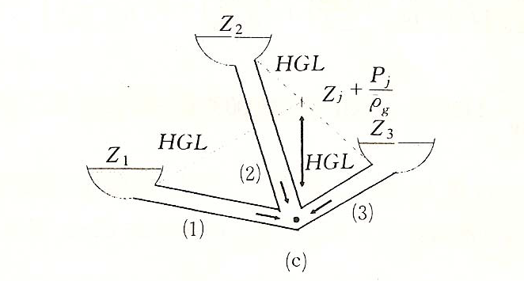

The program is used to calculate the complex pipe system, like the figure(c).

It will output the discharge of each pipe. If the discharge is negative, it
means that it’s inflow. And if the discharge is positive, it means it’s out
flow.

The input is each pipe’s elevation, length, and diameter. Then the program will
calculate the discharge of each pipe.
